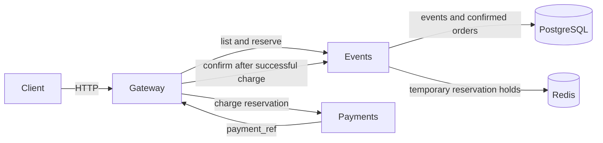

# Lab 1 — SRE Philosophy: Deploy, Break, Understand

All measurements below were collected locally on 2026-09-08. Tool versions:

```text
git version 2.47.1
Docker version 29.2.1, build a5c7197
Docker Compose version v5.0.2
Python 3.14.3
```

## Task 1 — Deploy & Break QuickTicket

### 1. Deployment

After `docker compose up --build -d`, all five application containers were running:

```text
$ docker compose ps
NAME             IMAGE                COMMAND                  SERVICE    CREATED          STATUS                    PORTS
app-events-1     app-events           "uvicorn main:app --…"   events     21 seconds ago   Up 14 seconds             0.0.0.0:8081->8081/tcp, [::]:8081->8081/tcp
app-gateway-1    app-gateway          "uvicorn main:app --…"   gateway    21 seconds ago   Up 14 seconds             0.0.0.0:3080->8080/tcp, [::]:3080->8080/tcp
app-payments-1   app-payments         "uvicorn main:app --…"   payments   21 seconds ago   Up 20 seconds             0.0.0.0:8082->8082/tcp, [::]:8082->8082/tcp
app-postgres-1   postgres:17-alpine   "docker-entrypoint.s…"   postgres   21 seconds ago   Up 20 seconds (healthy)   0.0.0.0:5432->5432/tcp, [::]:5432->5432/tcp
app-redis-1      redis:7-alpine       "docker-entrypoint.s…"   redis      21 seconds ago   Up 20 seconds (healthy)   0.0.0.0:6379->6379/tcp, [::]:6379->6379/tcp
```

### 2. Healthy Critical Path

#### List Events

```json
[
    {
        "id": 1,
        "name": "Go Conference 2026",
        "venue": "Main Hall A",
        "date": "2026-09-15T09:00:00+00:00",
        "total_tickets": 100,
        "price_cents": 5000,
        "available": 100
    },
    {
        "id": 4,
        "name": "Python Workshop",
        "venue": "Lab 301",
        "date": "2026-09-22T14:00:00+00:00",
        "total_tickets": 25,
        "price_cents": 2000,
        "available": 25
    },
    {
        "id": 2,
        "name": "SRE Meetup",
        "venue": "Room 204",
        "date": "2026-10-01T18:00:00+00:00",
        "total_tickets": 30,
        "price_cents": 0,
        "available": 30
    },
    {
        "id": 5,
        "name": "Kubernetes Deep Dive",
        "venue": "Auditorium B",
        "date": "2026-10-10T10:00:00+00:00",
        "total_tickets": 80,
        "price_cents": 8000,
        "available": 80
    },
    {
        "id": 3,
        "name": "Cloud Native Summit",
        "venue": "Expo Center",
        "date": "2026-11-20T10:00:00+00:00",
        "total_tickets": 500,
        "price_cents": 15000,
        "available": 500
    }
]
```

#### Reserve Ticket

```json
{
    "reservation_id": "6cbcf107-e0ad-46bb-a44f-7e5231817d5a",
    "event_id": 1,
    "quantity": 1,
    "total_cents": 5000,
    "expires_in_seconds": 300
}
```

#### Pay Reservation

The real reservation ID from the preceding response was used:

```json
{
    "order_id": "6cbcf107-e0ad-46bb-a44f-7e5231817d5a",
    "event_id": 1,
    "quantity": 1,
    "total_cents": 5000,
    "status": "confirmed"
}
```

### 3. Healthy State

```json
{
    "status": "healthy",
    "checks": {
        "events": "ok",
        "payments": "ok",
        "circuit_payments": "CLOSED"
    }
}
```

The gateway returned HTTP 200.

### 4. Dependency Map



Listing, event details, and reservation creation depend on `events`, while charging depends on `payments`. `events` reads durable event and order data from PostgreSQL and stores temporary reservation holds in Redis. After a successful charge, the gateway calls `events` again to commit the order. Consequently, different dependencies have different blast radii: a payments outage blocks checkout but not browsing or reservation, whereas a PostgreSQL outage affects almost all event operations.

### 5. Failure Exploration

Each dependency was stopped separately. The system was restored to HTTP 200 healthy state before the next experiment.

#### Payments Failure

With `payments` stopped, event browsing and a new reservation continued to work:

```text
GET /events
HTTP 200

POST /events/1/reserve
{"reservation_id":"1c502ac6-2777-4dc4-a4f8-eacbf460a531","event_id":1,"quantity":1,"total_cents":5000,"expires_in_seconds":300}
HTTP 200

POST /reserve/1c502ac6-2777-4dc4-a4f8-eacbf460a531/pay
{"detail":"Payment service unavailable"}
HTTP 502

GET /health
{"status":"degraded","checks":{"events":"ok","payments":"down","circuit_payments":"CLOSED"}}
HTTP 503
```

This is a narrow outage: customers can browse and hold tickets, but cannot pay. Before the Task 2 change the user received only a generic infrastructure-oriented HTTP 502.

#### Events Failure

A reservation was created before stopping `events` so the existing-reservation payment path could be tested:

```text
PRE_OUTAGE_RESERVATION=2d1376d6-1f56-47b7-92fe-affeb2d5a1d7

GET /events
{"detail":"Events service unavailable"}
HTTP 502

POST /events/1/reserve
{"detail":"Events service unavailable"}
HTTP 502

POST /reserve/2d1376d6-1f56-47b7-92fe-affeb2d5a1d7/pay
{"detail":"Payment succeeded but confirmation failed — contact support"}
HTTP 500

GET /health
{"status":"degraded","checks":{"events":"down","payments":"ok","circuit_payments":"CLOSED"}}
HTTP 503
```

The payments log confirms that the external charge happened before confirmation failed:

```text
Payment success: PAY-CAD27E86 for 2d1376d6-1f56-47b7-92fe-affeb2d5a1d7
```

This is a dangerous distributed partial failure: the customer may be charged, but no order is committed in `events`. The two services are left inconsistent and require reconciliation or support intervention.

#### Redis Failure

```text
PRE_OUTAGE_RESERVATION=082f1197-3c80-48fb-951a-b2c7e8505a51

GET /events
HTTP 200

POST /events/1/reserve
{"detail":"Events service timeout"}
HTTP 504

POST /reserve/082f1197-3c80-48fb-951a-b2c7e8505a51/pay
{"detail":"Payment succeeded but confirmation failed — contact support"}
HTTP 500

GET http://localhost:8081/health
{"status":"degraded","checks":{"postgres":"ok","redis":"down"}}
HTTP 503

GET http://localhost:3080/health
{"status":"degraded","checks":{"events":"down","payments":"ok","circuit_payments":"CLOSED"}}
HTTP 503
```

The payment side effect was again visible in the payments log (`PAY-FC1F0CCA`). Event listing survived because it reads PostgreSQL directly. Reservation creation and confirmation need Redis, so the write journey failed even while browsing remained available. The gateway reported `events` as down because its two-second dependency probe did not receive a successful events health response while the Redis check was failing.

#### PostgreSQL Failure

```text
PRE_OUTAGE_RESERVATION=028f4fd4-4f24-4fae-8bff-7ce2e0705a24

GET /events
{"detail":"Events service unavailable"}
HTTP 502

POST /events/1/reserve
Internal Server Error
HTTP 500

POST /reserve/028f4fd4-4f24-4fae-8bff-7ce2e0705a24/pay
{"detail":"Payment succeeded but confirmation failed — contact support"}
HTTP 500

GET /health
{"status":"degraded","checks":{"events":"degraded","payments":"ok","circuit_payments":"CLOSED"}}
HTTP 503
```

The payments log recorded `Payment success: PAY-B958E9E5` for this reservation, but confirmation could not write the order. PostgreSQL therefore had the broadest blast radius: browsing, reservation creation, and order confirmation all failed. After PostgreSQL became healthy again, `/health` recovered to HTTP 200 without restarting `events`, showing that its connection pool recovered automatically in this run.

### 6. Failure Summary

| Component Killed | Events List | Reserve | Pay | Health Check | User Impact |
|------------------|-------------|---------|-----|--------------|-------------|
| payments | Works — HTTP 200 | Works — HTTP 200 | Fails — HTTP 502, generic unavailable response | Degraded — HTTP 503; payments `down` | Browsing and ticket holds remain available; checkout is blocked. |
| events | Fails — HTTP 502 | Fails — HTTP 502 | Fails — HTTP 500 after a successful charge | Degraded — HTTP 503; events `down` | Nearly all user journeys fail; an existing reservation can be charged without being confirmed. |
| redis | Works — HTTP 200 | Fails — HTTP 504 timeout | Fails — HTTP 500 after a successful charge | Degraded — HTTP 503; direct events health shows Redis `down` | Browsing survives, but temporary holds and confirmation fail; charged-but-unconfirmed orders are possible. |
| postgres | Fails — HTTP 502 | Fails — HTTP 500 | Fails — HTTP 500 after a successful charge | Degraded — HTTP 503; events `degraded` | The durable source of truth is unavailable, so browsing and writes fail and charges cannot be committed as orders. |

### 7. Load Generator

#### Healthy Load

```text
$ ./loadgen/run.sh 5 30
[10s] requests=41 success=41 fail=0 error_rate=0%
[20s] requests=83 success=83 fail=0 error_rate=0%
---
Done. total=125 success=125 fail=0 error_rate=0%
```

#### Payments Failure Under Load

`payments` was stopped approximately ten seconds into the same mixed workload:

```text
$ ./loadgen/run.sh 5 30
[10s] requests=42 success=42 fail=0 error_rate=0%
Container app-payments-1 Stopped
[20s] requests=84 success=78 fail=6 error_rate=7.1%
---
Done. total=126 success=112 fail=14 error_rate=11.1%
```

The observed error rate increased from 0% at baseline to 11.1%. It did not reach 100% because the workload is 70% browsing, 20% reservation-only, and 10% full purchase flow; only payment attempts directly require `payments`.

### 8. Key SRE Observations

- A dependency outage is not automatically a total outage. Payments had a narrow checkout-only blast radius, while PostgreSQL affected almost the whole critical path.
- Health correctly became HTTP 503 even when some customer operations still worked. This is useful dependency-degradation information, but it should not be interpreted as “all endpoints are unavailable.”
- Redis failure demonstrated partial functionality: durable reads continued while temporary state operations failed.
- Charging before committing the order creates an externally visible side effect without consistent application state. A production design needs idempotency, reconciliation, or a transactional workflow such as a saga/outbox pattern.

## Task 2 — Graceful Degradation

### Implementation

The gateway now handles a payment connection failure separately. Existing timeout, downstream HTTP-error, circuit-breaker, and unexpected-error behavior remains unchanged.

```diff
diff --git a/app/gateway/main.py b/app/gateway/main.py
index c86db33..5c6a322 100644
--- a/app/gateway/main.py
+++ b/app/gateway/main.py
@@ -332,6 +332,19 @@ async def pay_reservation(reservation_id: str):
     except CircuitOpenError:
         log.error("circuit open, skipping payments call")
         raise HTTPException(503, "Payment service temporarily unavailable (circuit open)")
+    except httpx.ConnectError:
+        log.error("payment service unavailable")
+        return JSONResponse(
+            status_code=503,
+            content={
+                "error": "payments_unavailable",
+                "message": (
+                    "Payment service is temporarily down. "
+                    "Your reservation is held — try again in a few minutes."
+                ),
+                "reservation_id": reservation_id,
+            },
+        )
     except httpx.TimeoutException:
         raise HTTPException(504, "Payment service timeout")
     except httpx.HTTPStatusError as e:
```

### Verification

The gateway image was rebuilt before this test.

#### Event Details and Reservation While Payments Is Down

```text
GET /events/1
{"id":1,"name":"Go Conference 2026","venue":"Main Hall A","date":"2026-09-15T09:00:00+00:00","total_tickets":100,"price_cents":5000,"available":94}
HTTP 200

POST /events/1/reserve
{"reservation_id":"8308b9e6-9ed9-4229-b477-8eb95fddbc23","event_id":1,"quantity":1,"total_cents":5000,"expires_in_seconds":300}
HTTP 200
```

#### Payment While Payments Is Down

```text
POST /reserve/8308b9e6-9ed9-4229-b477-8eb95fddbc23/pay
{"error":"payments_unavailable","message":"Payment service is temporarily down. Your reservation is held — try again in a few minutes.","reservation_id":"8308b9e6-9ed9-4229-b477-8eb95fddbc23"}
HTTP 503
```

After `payments` recovered, retrying the same held reservation succeeded:

```text
{"order_id":"8308b9e6-9ed9-4229-b477-8eb95fddbc23","event_id":1,"quantity":1,"total_cents":5000,"status":"confirmed"}
HTTP 200
```

This changes a generic infrastructure failure into an explicit service-level error with a safe next action: the reservation remains held, and the user can retry later.

## Task 3 — GitHub Community

The following account actions were completed manually from an authenticated GitHub session:

- [x] Star `inno-devops-labs/SRE-Intro`.
- [x] Star `simple-container-com/api`.
- [x] Follow `Cre-eD`, `Naghme98`, and `pierrepicaud`.
- [x] Follow at least three classmates.

Stars make useful repositories easier to find again and improve project discovery and visibility. Following maintainers and classmates surfaces their work, supports collaboration, and helps build a professional network.

## Bonus — Resource Usage Under Load

Before these measurements, the stack and PostgreSQL volume were recreated with `docker compose down -v` followed by `docker compose up --build -d`. The system reported healthy before the idle snapshot.

### Idle

```text
NAME             CPU %     MEM USAGE / LIMIT     NET I/O           PIDS
app-events-1     0.26%     40.75MiB / 7.653GiB   4.63kB / 3.48kB   2
app-gateway-1    0.23%     38.04MiB / 7.653GiB   2.88kB / 1.95kB   2
app-payments-1   0.19%     34.86MiB / 7.653GiB   3.02kB / 685B     2
app-postgres-1   0.09%     27.91MiB / 7.653GiB   4.34kB / 2.49kB   8
app-redis-1      0.79%     9.449MiB / 7.653GiB   3.03kB / 638B     6
```

### Normal Load

The snapshot was taken around the middle of `./loadgen/run.sh 10 30`:

```text
NAME             CPU %     MEM USAGE / LIMIT     NET I/O           PIDS
app-events-1     1.90%     41.47MiB / 7.653GiB   167kB / 227kB     2
app-gateway-1    3.81%     38.45MiB / 7.653GiB   186kB / 183kB     2
app-payments-1   0.34%     35.03MiB / 7.653GiB   9.07kB / 4.98kB   2
app-postgres-1   0.57%     29.91MiB / 7.653GiB   95.8kB / 106kB    8
app-redis-1      0.92%     9.531MiB / 7.653GiB   29.6kB / 11.9kB   6
```

```text
Done. total=211 success=211 fail=0 error_rate=0%
```

### Payments Fault Injection

The payments health endpoint confirmed that the requested settings were active:

```text
{"status":"healthy","failure_rate":0.3,"latency_ms":500}
HTTP 200
```

Mid-run resource snapshot:

```text
NAME             CPU %     MEM USAGE / LIMIT     NET I/O           PIDS
app-events-1     1.74%     41.29MiB / 7.653GiB   404kB / 546kB     2
app-gateway-1    4.05%     38.57MiB / 7.653GiB   462kB / 458kB     2
app-payments-1   0.27%     35.02MiB / 7.653GiB   6.05kB / 4.43kB   2
app-postgres-1   0.49%     30MiB / 7.653GiB      226kB / 262kB     8
app-redis-1      1.99%     9.797MiB / 7.653GiB   61.2kB / 25kB     6
```

```text
Done. total=159 success=151 fail=8 error_rate=5.0%
```

Finally, payments was recreated with normal settings and both direct and gateway health recovered:

```text
{"status":"healthy","failure_rate":0.0,"latency_ms":0}
HTTP 200

{"status":"healthy","checks":{"events":"ok","payments":"ok","circuit_payments":"CLOSED"}}
HTTP 200
```

### Analysis

`events` used the most memory in all three snapshots: 40.75 MiB idle, 41.47 MiB under normal load, and 41.29 MiB during payment faults. The memory leader therefore did not change. `gateway` used the most CPU under both measured load conditions (3.81% normally and 4.05% with payment faults), which is consistent with routing every request and coordinating both downstream calls for checkout.

Payment latency increases the time the gateway waits for a downstream response, which can increase concurrent in-flight work and resource pressure in a concurrent workload. In these measurements the gateway changed only from 38.45 to 38.57 MiB and from 3.81% to 4.05% CPU, so a material resource increase is not established by this single noisy snapshot. The stronger observed effects were application-level: 5.0% errors and lower completed throughput (159 requests versus 211). This load generator is sequential, so added latency reduces its request rate rather than creating a large concurrent queue; only the 10% purchase-flow portion calls payments, and only 30% of those charge attempts were configured to fail.
